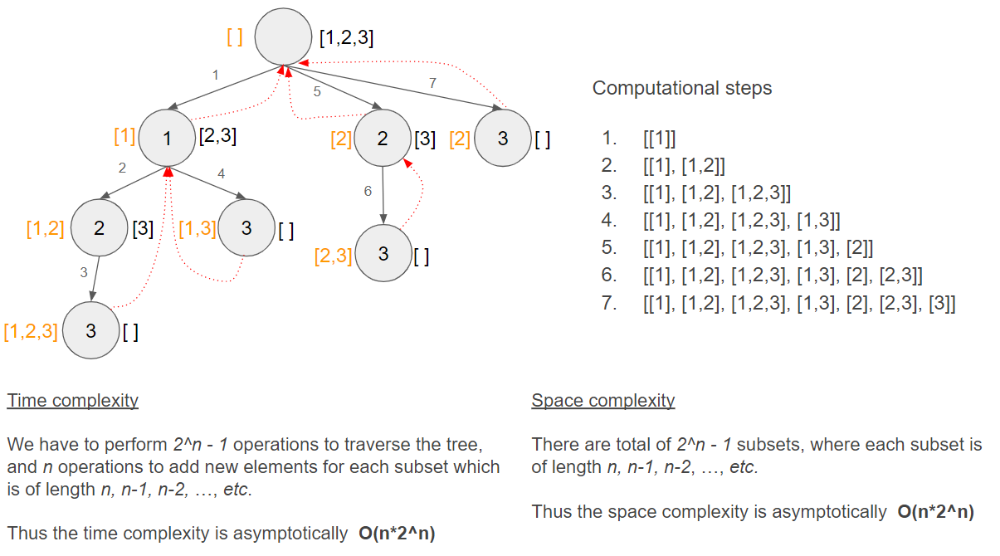

# Coding challenge

## Technical Question: Powerset

Suppose you're given a file with a single string of comma separated numbers like the following
```
$ cat input
123,456,789
```

Your program must print to STDOUT the powerset of the given set, like follows
(actual order is not relevant)

```
$ cat input | <your program> > output
$ cat output

123
456
789
123,456
123,789
456,789
123,456,789
```

Your solution must print to STDOUT and any extraneous output will be considered
an error (but you may print to STDERR at your convenience). Your program will be
tested against inputs of growing size, the more they can take, the better!

The solution must contain documentation explaining time and space complexity of
your implementation.

You should use only stuff other than the standard library of your language of
choice, any additional requirement should be documented and motivated. Java,
Python, Scala or Rust are preferred.

## Code design and time/space complexity analysis

The code has been written in Python 3.7, and no external libraries or dependencies were used for this solution. 

### Requirements and assumptions

- Accepts and process only the input composed of, comma separated, strings of elements.
- Raise an exception and gracefully exit the code if input does not match the first conditions.
- The results are printed to STDOUT.
- The order of the result does not matter.
- The void set is ignored.

### Design

```
for each elem in elements:
    i is position(elem, elements)
    recur([elem], i)

recur(res, pos):
    result.append(res)
    for each elem in elements:
        i is position(elem, elements)
        res = res.append(elem)
        recur(res, i)
```     

### Time and space complexity analysis

- Space complexity is O(n*2^n)
- Time complexity is O(n*2^n)

 

### Performance measurement

The best performing algorithm is `powerset_pythonic`. Note that all algorithms fail with `MemoryError` from length subset of 25.   

  


## References

[1] https://en.wikipedia.org/wiki/Power_set  
[2] https://rosettacode.org/wiki/Power_set  
[3] https://cs.stackexchange.com/questions/121230/explanation-of-on2n-time-complexity-for-powerset-generation  
[4] https://www.geeksforgeeks.org/power-set/  
[5] https://docs.python.org/3/library/itertools.html#itertools.combinations  
[6] https://docs.python.org/3/library/itertools.html#itertools-recipes  
[7] https://stackoverflow.com/questions/24365954/how-to-generate-a-power-set-of-a-given-set   